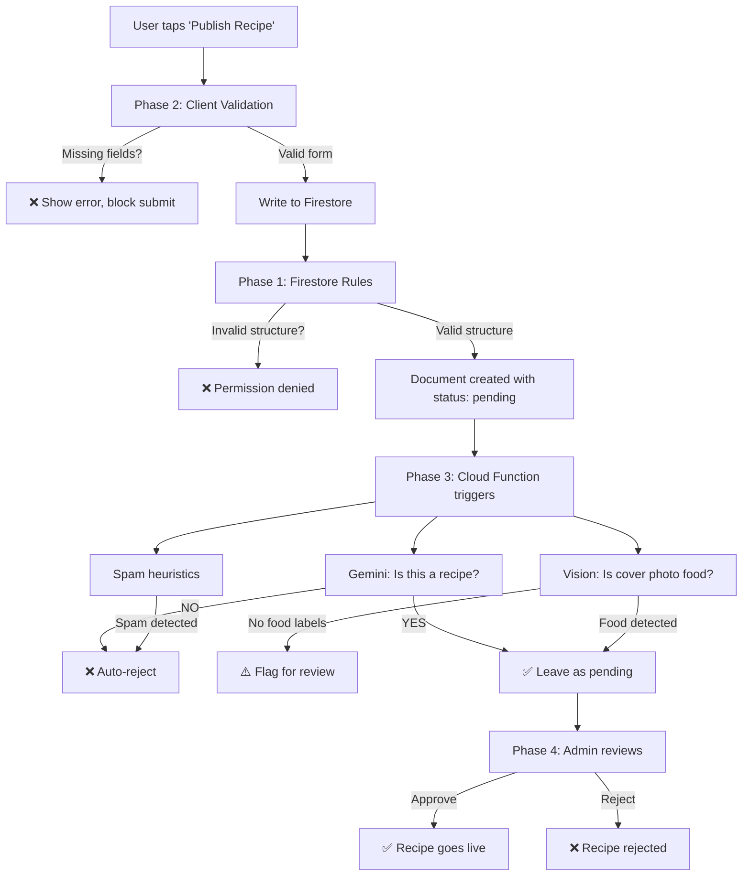

# Recipe Content Validation & Moderation System

Ensure that users can only upload actual food recipes — not spam, random content, or non-food material — by enforcing validation at every layer: client UI, Firestore rules, Cloud Functions, and (optionally) AI-powered screening.

---

## What You Need to Provide / Set Up

> [!IMPORTANT]
> **You already have a Firebase project on Blaze plan** (`la-mia-e348d`). Most of the work below uses services you already pay for or that have generous free tiers. Here's what you'll need:

### Required accounts & keys

| What | Do you have it? | Where to get it | Cost |
|---|---|---|---|
| **Firebase Blaze plan** | ✅ Yes (already on it) | — | Pay-as-you-go, but free tiers cover small apps |
| **Gemini API key** | ❌ Need to generate | [Google AI Studio](https://aistudio.google.com/) → Get API Key | **Free tier available** (see below) |
| **Cloud Vision API** | ❌ Need to enable | Google Cloud Console → APIs & Services → Enable "Cloud Vision API" | **Free tier: 1,000 units/month** |
| **Cloud Functions** | ❌ Not deployed yet | Already configured in your architecture doc; needs `functions/` directory | **Free tier: 2M invocations/month** |

### 💰 Pricing breakdown — Can you use the free tier?

| Service | Free tier | What La Mia would use | Will free tier be enough? |
|---|---|---|---|
| **Gemini API** | Free tier available via Google AI Studio (rate-limited, ~15 RPM for Flash models). Your input data may be used by Google to improve products on free tier. | ~1 API call per recipe submission (text check) | ✅ **Yes for launch.** Even 100 recipes/day is fine. |
| **Cloud Vision API** | **1,000 units/month free**, then ~$1.50/1,000 units | 1 unit per cover photo (Label Detection) | ✅ **Yes for launch.** You'd need 1,000+ recipe submissions/month to exceed it. |
| **Cloud Functions** | **2M invocations/month free**, 400K GB-seconds | 1 invocation per recipe create | ✅ **Easily.** |
| **Firestore** | 50K reads, 20K writes, 20K deletes/day free | Moderation reads/writes are tiny | ✅ **Easily.** |

> [!TIP]
> **Bottom line: You can run this entire moderation system for FREE at launch.** The free tiers are more than enough for a new app. You'd only start paying when you get thousands of recipe submissions per month — at which point the app is succeeding and the cost is pennies.

> [!WARNING]
> **Gemini API "billing trap":** Since your Firebase project is on the Blaze plan (billing enabled), the Gemini API free tier may not apply to this project. To be safe, you can either:
> 1. Use a **separate Google Cloud project** (no billing) just for the Gemini API key, or
> 2. Use the Gemini API via **Google AI Studio** (ai.google.dev) with a key from there, not through Vertex AI
> 3. Set up **budget alerts** in Google Cloud Console to catch unexpected charges

---

## Proposed Changes

The plan is organized in 4 phases, from easiest/most critical to advanced. Each phase is independent — you can stop at any phase and still have meaningful protection.

---

### Phase 1: Firestore Security Rules — Structural Validation (FREE, no API keys needed)

> This is the **most important** layer. Even if someone bypasses your Flutter app entirely and writes directly to Firestore, these rules reject anything that doesn't look like a recipe.

#### [MODIFY] [firestore.rules](file:///c:/Users/My%20PC/OneDrive/Documents/LaMia/lamia_app/firestore.rules)

Strengthen the `allow create` rule (currently lines 92–98) to enforce:

- `name` is a string, at least 3 characters
- `category` must be from the predefined list (Breakfast, Lunch, Dinner, Snacks, Desserts, Soup, Vegetables, Chicken, Pork, Beef, Seafood, Filipino, International)
- `ingredients` is a list with at least 2 items
- `instructions` is a list with at least 2 steps
- `servings` is an integer > 0
- `coverPhotoUrl` is a non-empty string
- `prepTime` and `cookTime` are non-empty strings
- `difficulty` must be from a valid set (Easy, Medium, Hard)
- **Force `status: 'pending'`** on all user-created recipes (users can't self-approve)

Also add **rate limiting** by requiring `createdAt` to use `request.time` (server timestamp), which prevents backdating.

---

### Phase 2: Client-Side Form Validation (FREE, no API keys needed)

> Good UX — prevents innocent mistakes and makes the upload form feel guided.

#### [MODIFY] [recipe_creating_screen.dart](file:///c:/Users/My%20PC/OneDrive/Documents/LaMia/lamia_app/lib/features/recipes/presentation/recipe_creating_screen.dart)

- Enforce all required fields before the "Publish" button is enabled
- Category picker uses a fixed enum dropdown (not free-text)
- Difficulty picker uses a fixed enum dropdown
- Minimum 2 ingredients, minimum 2 instruction steps
- Cover photo is required (disable submit without it)
- Show inline validation errors with clear messaging

#### [MODIFY] [recipe_repository.dart](file:///c:/Users/My%20PC/OneDrive/Documents/LaMia/lamia_app/lib/features/recipes/data/recipe_repository.dart)

- In `addRecipe()`, force `status: 'pending'` for all user-submitted recipes (currently the model defaults to `'approved'`)
- This ensures even if the UI has a bug, the repository layer always sets pending

#### [MODIFY] [recipe_model.dart](file:///c:/Users/My%20PC/OneDrive/Documents/LaMia/lamia_app/lib/features/recipes/data/recipe_model.dart)

- Change the default `status` from `'approved'` to `'pending'` for user-created recipes in `toFirestoreForCreate()`

---

### Phase 3: Cloud Function — AI Content Screening (Needs Gemini API key + Cloud Vision API)

> Automated screening on the server side. Runs when a recipe is created in Firestore.

#### [NEW] `functions/` directory at project root

Set up a Firebase Cloud Functions project (Node.js/TypeScript):

```
lamia_app/
└── functions/
    ├── package.json
    ├── tsconfig.json
    ├── src/
    │   ├── index.ts              # exports all functions
    │   ├── onRecipeCreate.ts     # Firestore onCreate trigger
    │   ├── validators/
    │   │   ├── textValidator.ts  # Gemini API — checks if text is recipe-related
    │   │   └── imageValidator.ts # Cloud Vision — checks if image is food
    │   └── config.ts             # API keys, thresholds
    └── .env                      # GEMINI_API_KEY (you provide this)
```

#### `onRecipeCreate` Cloud Function

**Trigger:** `onDocumentCreated("recipes/{recipeId}")`

**What it does:**
1. **Text check (Gemini API):** Sends recipe title + description + first 3 ingredients to Gemini Flash with a prompt like:
   > "Is this a food recipe? Respond with only YES or NO. Title: {title}, Description: {desc}, Ingredients: {ingredients}"
   
   - If **NO** → set `status: 'rejected'`, add `rejectionReason: 'Content does not appear to be a food recipe'`
   
2. **Image check (Cloud Vision API):** Sends the cover photo URL to Cloud Vision Label Detection:
   - Check if any returned labels include food-related terms (food, dish, cuisine, meal, ingredient, etc.)
   - If **no food labels found** → flag for manual review (set `status: 'flagged'`)
   
3. **Spam check:** Basic heuristics:
   - Title or description contains URLs → reject
   - Title is all caps → flag
   - Same user submitted > 5 recipes in the last hour → reject (rate limiting)

4. If all checks pass → leave as `status: 'pending'` for human approval (launch mode), or auto-approve if you trust the AI (later)

#### What you need to provide for this phase:

1. **Gemini API Key:**
   - Go to [Google AI Studio](https://aistudio.google.com/)
   - Click "Get API Key" → "Create API key in new project" (recommended to keep it separate from your Blaze project)
   - Copy the key → store it as a Firebase Functions secret:
     ```bash
     firebase functions:secrets:set GEMINI_API_KEY
     ```

2. **Cloud Vision API:**
   - Go to [Google Cloud Console](https://console.cloud.google.com/) → your `la-mia-e348d` project
   - Navigate to **APIs & Services → Library**
   - Search for "Cloud Vision API" → click **Enable**
   - No separate API key needed — Cloud Functions in the same project can call it automatically using the service account

3. **Deploy Cloud Functions:**
   ```bash
   cd lamia_app
   firebase deploy --only functions
   ```

---

### Phase 4: Admin Moderation Dashboard + Community Reporting (FREE, no API keys)

> Human review for recipes that pass automated screening. This is what your concept doc already commits to.

#### [NEW] Admin review screen in the Flutter app

- Query `recipes` where `status == 'pending'`
- Show recipe preview (cover photo, title, ingredients, instructions)
- Approve / Reject buttons (only visible to users with `role == 'admin'`)
- On approve → update `status` to `'approved'`, set `approvedAt`
- On reject → update `status` to `'rejected'`, optionally add `rejectionReason`

#### [NEW] Community report feature

- "Report" button on recipe detail screen
- Creates a document in `reports` collection
- Cloud Function `onReportThreshold` auto-hides recipe when report count exceeds threshold (e.g., 3 reports)

---

## Summary: What goes where



---

## Open Questions

> [!IMPORTANT]
> **1. Do you want ALL recipes to go through admin approval, or should AI-approved recipes auto-publish?**
> - Option A: All recipes require manual admin approval (safest, your concept doc says this for launch)
> - Option B: AI-approved recipes auto-publish, only flagged ones need admin review (faster for users, slight risk)

> [!IMPORTANT]
> **2. Should we implement all 4 phases now, or start with Phases 1–2 (free, no API keys) and add AI screening later?**
> - Phases 1–2 alone give you solid protection with zero cost
> - Phase 3 (AI) is the most work but catches the most edge cases

> [!IMPORTANT]
> **3. Do you already have a Google Cloud account / have you used Google AI Studio before?**
> - This affects how I guide you through API key setup
> - If you've never used it, I can walk you through it step by step

## Verification Plan

### Automated Tests
- Deploy updated Firestore rules → run `firebase emulators:exec` with test cases (valid recipe, missing fields, wrong category, self-approval attempt)
- Cloud Function unit tests with mock Firestore triggers

### Manual Verification
- Try submitting a recipe with missing fields → should be blocked by client + rules
- Try submitting non-food content (e.g., title "Buy my NFTs") → should be caught by Gemini
- Try uploading a non-food image → should be flagged by Cloud Vision
- Verify admin can approve/reject from the moderation screen
