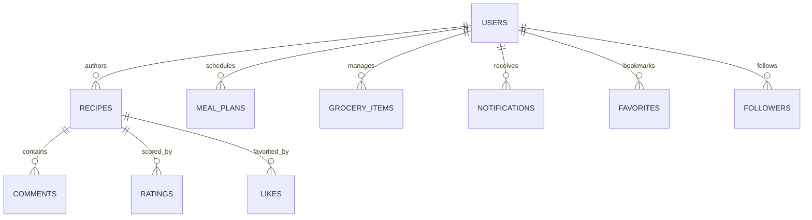

# 🍽️ La Mia — Discover, Cook, and Share Authentic Filipino Recipes

<div align="center">
  

  ### *"Discover, Cook, and Share Delicious Filipino Recipes"*

  [](https://flutter.dev/)
  [](https://dart.dev/)
  [](https://firebase.google.com/)
  [](https://riverpod.dev/)
  [](LICENSE)
</div>

---

## 📱 What is La Mia?

**La Mia** is a modern, community-driven mobile culinary ecosystem built specifically for Filipino cuisine. More than just a recipe archive, La Mia acts as an everyday kitchen companion designed to solve the two most common cooking dilemmas in Filipino households:
1. **"Ano pong ulam?"** (What should I cook today?)
2. **"What can I cook with what I already have?"**

By combining pantry-based ingredient matching, structured weekly meal planning, an interactive grocery checklist, and community recognition for home cooks, La Mia transforms everyday cooking from a stressful chore into a creative, culturally rich journey.

---

## 🌟 Key Features

| Feature | Description |
|---|---|
| 🍳 **Cook by Ingredients** | Enter ingredients on hand in your pantry to instantly find matching recipes, calculated match percentages, missing item alerts, and smart Pinoy substitutions (*e.g., calamansi ↔ lemon*). |
| 🍽️ **"Ano Pong Ulam?" Engine** | One-tap decision helper delivering curated meal suggestions filtered by budget, cooking time, difficulty, servings, and dish category. |
| 📅 **Weekly Meal Planner** | Schedule meals for Breakfast, Lunch, Dinner, and Snacks across a 7-day cyclical calendar (Monday–Sunday). |
| 🛒 **Smart Grocery Checklist** | Categorized shopping checklist that auto-imports ingredients directly from your weekly meal plan or favorite recipes. |
| 🏆 **Chef Leaderboards & Community** | Climb rankings through recipe contributions, earn likes, receive 5-star ratings, and follow your favorite home chefs. |
| 💬 **Social Hub & Threaded Comments** | Community recipe reviews with 1–5 star ratings, rich comments, and nested replies. |
| 🔐 **Hybrid Authentication** | Frictionless Guest Mode for instant recipe browsing, Google OAuth, and secure 6-digit Email OTP registration powered by Cloud Functions and Resend API. |
| 📱 **Offline-Ready Favorites** | Saved recipes are cached locally on device via SQLite (`sqflite`), allowing uninterrupted cooking in kitchens with poor reception. |

---

## 🎨 Design System & Color Palette

La Mia’s UI blends warm Filipino culinary "appetite" tones with accents inspired by the Philippine flag and traditional *banig* woven motifs:

* 🧱 **Primary (Terracotta) — `#C4462B`**: Call-to-actions, buttons, and active tabs. Inspired by traditional clay cooking pots (*palayok*) and rich stews (*afritada*, *kaldereta*).
* 🥥 **Canvas (Warm Cream) — `#FBF6EF`**: Soft, non-glare coconut milk (*gata*) background tone that reduces eye strain in bright kitchen lighting.
* 🔵 **Secondary (Royal Blue) — `#1B3B8B`**: Inspired by the Philippine flag; used for the *"Ano Pong Ulam?"* card gradient and trust badges.
* ☀️ **Accent (Warm Amber) — `#F2A03D`**: Golden sun amber used for 5-star review ratings and culinary badges.
* 🍈 **Success (Calamansi Green) — `#3E8E5A`**: Completed checklist items and 100% pantry match indicators.

---

## 🏗️ System Architecture & Tech Stack

La Mia adheres to **Clean Layered Architecture** with strict inward dependency flow (Presentation → Domain ← Data):

```
┌────────────────────────────────────────────────────────┐
│                   CLIENT (FLUTTER)                     │
│   • Presentation: Riverpod Notifiers + UI Widgets      │
│   • Domain: Pure Entities & Repository Interfaces      │
│   • Data Layer: Firebase Data Sources + Local SQLite   │
└──────────────────────────┬─────────────────────────────┘
                           │ HTTPS / WebSockets
┌──────────────────────────▼─────────────────────────────┐
│                 BACKEND (GOOGLE FIREBASE)              │
│   • Firebase Authentication (Email/Password & Google)  │
│   • Cloud Functions (Node.js/TS): Algorithmic Logic    │
│   • Cloud Storage: High-Resolution Food Photography    │
└──────────────────────────┬─────────────────────────────┘
                           │ Secure API
┌──────────────────────────▼─────────────────────────────┐
│            DATABASE & EXTERNAL INTEGRATIONS            │
│   • Cloud Firestore (NoSQL Scalable Document DB)       │
│   • Resend API (Transactional 6-Digit Email OTP)       │
└────────────────────────────────────────────────────────┘
```

* **Mobile SDK**: [Flutter](https://flutter.dev/) (Dart 3.x, stable channel)
* **State Management**: [Riverpod v2](https://riverpod.dev/) (`flutter_riverpod`, `riverpod_annotation`)
* **Navigation**: [go_router](https://pub.dev/packages/go_router) with deep linking and auth guards
* **Cloud Database**: [Cloud Firestore](https://firebase.google.com/docs/firestore) (distributed real-time NoSQL)
* **Local Storage**: [sqflite](https://pub.dev/packages/sqflite) (offline recipe caching)
* **Authentication**: [Firebase Auth](https://firebase.google.com/docs/auth) + Google Sign-In
* **Backend Compute**: [Firebase Cloud Functions](https://firebase.google.com/docs/functions) (Node.js / TypeScript)
* **Transactional Email**: [Resend API](https://resend.com/) for 6-digit numeric OTP delivery

---

## 📊 Database Architecture & Data Model

The Firestore database leverages denormalized counters (`like_count`, `rating_avg`, `follower_count`) for instant single-read query performance:



* Detailed documentation:
  * **Interactive Schema**: See [database_diagram.html](docs/database_diagram.html)
  * **DBML Definition**: See [la_mia_schema.dbml](la_mia_schema.dbml)
  * **Full Presentation & Architecture**: See [docs/la_mia_presentation.md](docs/la_mia_presentation.md)

---

## 📁 Repository Structure

```text
LaMia/
├── docs/                           # Architecture, presentation & database diagrams
│   ├── database_diagram.html       # Visual standalone database diagram
│   ├── la_mia_presentation.md      # Comprehensive 13-part project presentation
│   └── schema.dbml                 # Database markup definition
│
├── lamia_app/                      # Core Flutter Mobile Application
│   ├── android/                    # Android native configuration
│   ├── ios/                        # iOS native configuration
│   ├── assets/                     # App icons, logos, and static assets
│   ├── lib/
│   │   ├── app/                    # Theme tokens (AppColors, AppTypography, AppTheme)
│   │   ├── core/                   # Shared widgets, providers, logger, validators
│   │   ├── features/
│   │   │   ├── auth/               # Sign In, Sign Up, OTP Verification, Guest Auth
│   │   │   ├── home/               # Feed, Featured, Trending, "Ano Pong Ulam?"
│   │   │   ├── recipes/            # Recipe Details, Creation, Cook by Ingredients
│   │   │   ├── planner/            # Weekly Meal Planner & Smart Grocery List
│   │   │   ├── social/             # Likes, Ratings, Threaded Comments, Follows
│   │   │   ├── leaderboard/        # Top Chef Rankings & Contributor Badges
│   │   │   ├── profile/            # User Profiles, Uploads, Favorites, Settings
│   │   │   └── notifications/      # Activity & Social Notifications
│   │   └── main.dart               # Application entry point
│   ├── test/                       # 200+ Unit and Widget tests
│   ├── firestore.rules             # Cloud Firestore security rules
│   ├── firestore.indexes.json      # Firestore composite indexes
│   └── pubspec.yaml                # Flutter dependencies
│
├── recipes/                        # Curated Filipino staple recipe datasets
└── tools/                          # Node.js Firebase admin seeding scripts
    ├── seed_recipes.js             # Seeds recipes & ingredients to Firestore
    └── seed_featured.js            # Calculates ranking scores and trending status
```

---

## 🚀 Getting Started

### Prerequisites

* [Flutter SDK](https://docs.flutter.dev/get-started/install) (`>= 3.12.2`)
* [Dart SDK](https://dart.dev/get-dart) (`>= 3.0.0`)
* [Node.js](https://nodejs.org/) (`v18+`)
* [Firebase CLI](https://firebase.google.com/docs/cli) (`npm install -g firebase-tools`)

### Installation & Setup

1. **Clone the repository:**
   ```bash
   git clone https://github.com/tonyontech101/La-Mia.git
   cd LaMia
   ```

2. **Install Flutter dependencies:**
   ```bash
   cd lamia_app
   flutter pub get
   ```

3. **Configure Firebase:**
   ```bash
   # Log in to Firebase CLI
   firebase login

   # Auto-configure FlutterFire
   flutterfire configure
   ```
   *(Ensure `google-services.json` is in `lamia_app/android/app/` and `GoogleService-Info.plist` is in `lamia_app/ios/Runner/`).*

4. **Seed Database (Optional):**
   ```bash
   cd ../tools
   npm install
   # Place your serviceAccountKey.json in the tools/ directory
   node seed_recipes.js
   node seed_featured.js
   ```

5. **Run the Application:**
   ```bash
   cd ../lamia_app
   flutter run
   ```

---

## 🧪 Testing & Code Quality

La Mia maintains high test coverage across all features, data repositories, and state notifiers:

```bash
cd lamia_app

# Run all 207+ unit and widget tests
flutter test

# Run static analysis
flutter analyze
```

---

## 📄 License

This project is licensed under the MIT License — see the [LICENSE](LICENSE) file for details.
