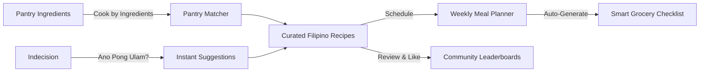
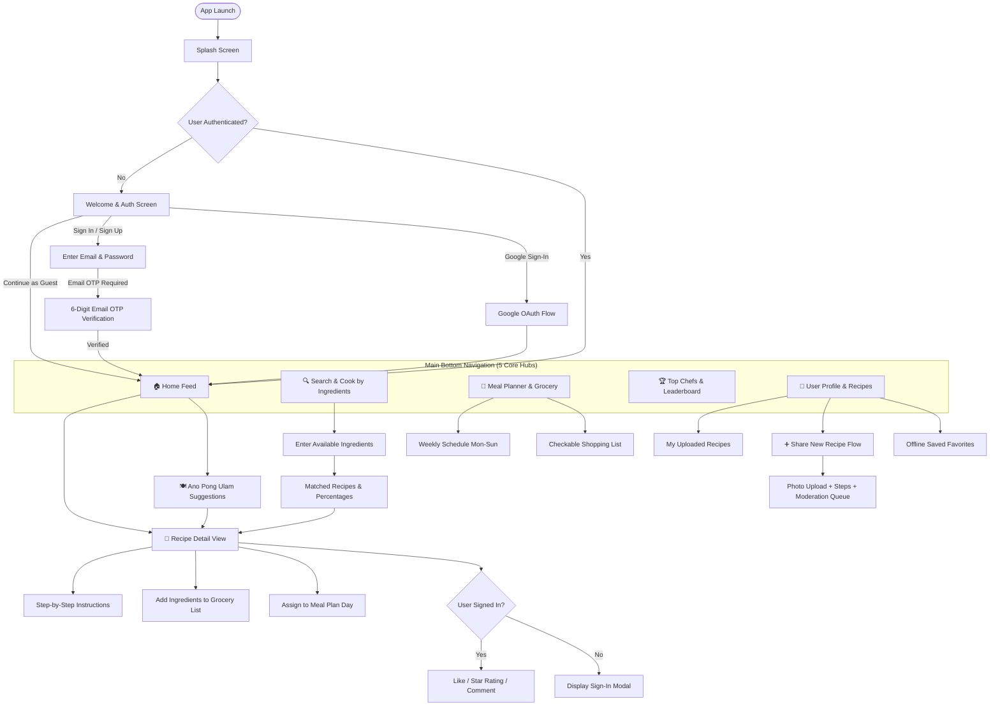
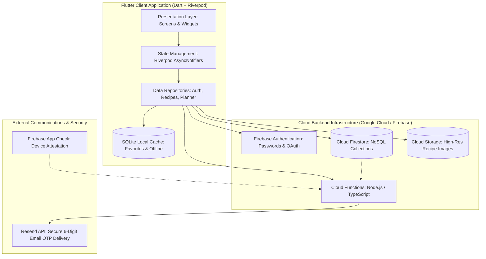
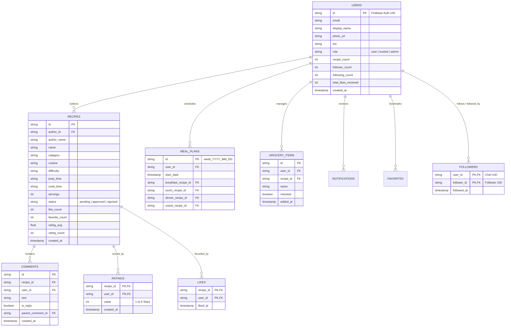

# 🍽️ La Mia — Project Presentation & Technical Documentation

---

## 1. Title & Brand Identity

<div align="center">
  

  # **La Mia**
  ### *"Discover, Cook, and Share Delicious Filipino Recipes"*

  **Platform:** Android & iOS (Flutter Stable) &bull; **Backend:** Firebase Cloud Architecture &bull; **Audience:** Global Filipino Culinary Community
</div>

---

### Introduction
**La Mia** is a mobile culinary platform crafted to preserve, celebrate, and modernize Filipino home cooking. More than just a digital recipe archive, La Mia acts as an everyday kitchen companion that tackles the perpetual question in every Filipino household: **"Ano pong ulam?"** (What's for dinner?).

By pairing community recipe sharing with an intelligent pantry-matching engine, structured weekly meal planning, an interactive smart grocery list, and a social recognition system for home chefs, La Mia bridges the gap between traditional family culinary heritage and modern digital convenience.

---

## 2. Problem Statement

Filipino culinary culture is deeply communal and vibrant, yet modern home cooks encounter significant everyday challenges in the kitchen:

```
┌────────────────────────────────────────────────────────────────────────┐
│                      CORE PAIN POINTS SOLVED                           │
├────────────────────┬────────────────────┬──────────────────────────────┤
│ 1. Decision        │ 2. Food Waste &    │ 3. Scattered Recipe          │
│    Paralysis       │    Budget Strain   │    Knowledge                 │
│ "Ano pong ulam?"   │ Ingredients go bad │ Recipes are lost on social   │
│ causes daily       │ because users lack │ media feeds, chat messages,  │
│ kitchen fatigue    │ recipes for items  │ or paper notes without       │
│ and repetitive     │ on hand in their   │ standardized measurements    │
│ meal choices.      │ fridge or pantry.  │ or cooking times.            │
└────────────────────┴────────────────────┴──────────────────────────────┘
```

1. **Daily Decision Paralysis ("Ano pong ulam?"):**
   Every day, millions of households spend unnecessary time debating what to prepare. Traditional cooking apps present endless unstructured recipe lists that increase cognitive overload rather than narrowing down options.

2. **Food Waste and Kitchen Inefficiency:**
   Excess vegetables, half-used sauces, and leftover pantry staples frequently spoil because home cooks cannot easily determine which dishes utilize their existing kitchen inventory.

3. **Disorganized and Fragile Recipe Preservation:**
   Heirloom family recipes—from regional Ilocano *pinakbet* to authentic Kapampangan *sisig*—are often passed down through word of mouth, informal notes, or transient social media posts without clear step-by-step guidance, ingredient scaling, or nutritional context.

4. **Absence of a Dedicated Culinary Community:**
   Home chefs lack a focused, supportive social platform where their cooking skills are celebrated, recipe contributions are peer-reviewed, and Filipino food culture can flourish globally.

---

## 3. Proposed Solution

**La Mia** solves these problems by providing an all-in-one mobile ecosystem that guides the user from grocery planning to cooking execution:

<div align="center">



</div>

- **Smart "Cook by Ingredients" Engine:** A user-driven pantry search where cooks enter whatever is in their refrigerator (e.g., pork, tomatoes, onions) and instantly receive ranked recipes showing exact match percentages, missing items, and smart ingredient substitutions (e.g., *calamansi* for *lemon*).
- **"Ano Pong Ulam?" Instant Suggestion Engine:** A one-tap decision maker that filters by budget, meal type (breakfast, lunch, dinner, snack), preparation time, and servings to provide instant dish inspiration.
- **Weekly Meal Planner & Smart Grocery Integration:** Users can plan meals for the entire week and tap a button to add all required ingredients directly into a checklist grocery list.
- **Community Hub & Chef Leaderboard:** Users rate recipes (1–5 stars), leave comments with nested replies, follow respected home cooks, and earn recognition on the contributor leaderboard.
- **Offline-Ready Favorites:** Saved recipes are preserved locally so cooking can continue uninterrupted, even in kitchens with poor cellular connectivity.

---

## 4. Target Users

La Mia is engineered for diverse user segments across the culinary spectrum:

| User Persona | Key Needs | Primary App Touchpoints |
|---|---|---|
| **The Family Homemaker** | Budget-friendly meal planning, cutting grocery waste, feeding 4–6 family members daily. | *Ano Pong Ulam?*, Weekly Meal Planner, Smart Grocery Checklist. |
| **Young Professionals & Students** | Fast, simple meals with low preparation time, utilizing minimal kitchen equipment. | *Cook by Ingredients*, Quick Filter (under 30 mins), Step-by-Step Cooking Mode. |
| **The Overseas Filipino (OFW & Diaspora)** | Authentic tastes of home, localized ingredient substitution advice for foreign grocery markets. | Regional Filipino Recipes, Ingredient Substitutions, Community Discussions. |
| **Culinary Creators & Passionate Cooks** | Publishing family recipes, building a follower base, gaining recognition on rankings. | Recipe Publishing Suite, Public Chef Profile, Leaderboard, Likes & Ratings. |

---

## 5. Main Features

### Feature Breakdown

```
╔═════════════════════════════════════════════════════════════════════════╗
║                             CORE CAPABILITIES                           ║
╠═════════════════════════╦═════════════════════════╦═════════════════════╣
║ 🍳 Cook by Ingredients  ║ 🍽️ Ano Pong Ulam?       ║ 📅 Weekly Planner   ║
║ Multi-ingredient match  ║ Instant curated         ║ Schedule meals Mon  ║
║ with missing item alerts║ daily suggestions       ║ through Sun         ║
╠═════════════════════════╬═════════════════════════╬═════════════════════╣
║ 🛒 Smart Grocery List   ║ 🏆 Chef Leaderboards    ║ 💬 Community Social ║
║ Auto-synced checklist   ║ Top ranked home cooks   ║ Threaded comments,  ║
║ by ingredient category  ║ and trending recipes    ║ ratings & follows   ║
╠═════════════════════════╬═════════════════════════╬═════════════════════╣
║ 🔐 Secure Multi-Auth    ║ 📖 Detailed Cook View   ║ 📱 Offline Cache    ║
║ Email OTP + Google +    ║ Ingredients scale, step ║ Cook anywhere with  ║
║ guest browsing access   ║ by step instructions    ║ local device cache  ║
╚═════════════════════════╩═════════════════════════╩═════════════════════╝
```

1. **🍳 Cook by Ingredients (Smart Pantry Search)**
   - Enter multiple raw ingredients.
   - Calculates match percentage based on non-staple ingredients.
   - Displays clear indicators of missing items so users know what to purchase.
   - Accounts for canonical ingredient aliases (*kamatis* ↔ *tomato*, *bawang* ↔ *garlic*).

2. **🍽️ "Ano Pong Ulam?" (One-Tap Meal Recommender)**
   - Curated daily recommendation engine.
   - Multi-facet filters: Budget, Cooking Time, Difficulty Level, Servings, and Category (Pork, Chicken, Beef, Seafood, Vegetables, Soups).

3. **📖 Recipe Details & Cooking Mode**
   - High-resolution hero imagery, preparation time, cook time, and total duration.
   - Interactive ingredient checklist with dynamic serving size multipliers.
   - Ordered step-by-step preparation and cooking instructions.
   - Verified author profile cards with follow/unfollow capability.

4. **📅 Weekly Meal Planner**
   - Drag-and-drop or select recipes for Breakfast, Lunch, Dinner, and Snacks.
   - 7-day cyclical calendar view.
   - One-tap sync: "Export Ingredients to Grocery List".

5. **🛒 Interactive Smart Grocery List**
   - Categorized grocery checklists (Produce, Meat, Spices, Dairy, Pantry).
   - Check off items while shopping in the market or supermarket.
   - Add custom ad-hoc items or ingredients directly from any recipe.

6. **🏆 Chef Leaderboards & Social Networking**
   - Real-time ranking of top culinary contributors based on likes and average ratings.
   - 5-Star rating system with calculated average score.
   - Threaded discussion comments with nested replies.
   - Follower and Following feeds.

7. **🔐 Hybrid Authentication System**
   - **Guest Mode:** Immediate browsing, searching, and reading without login walls.
   - **Full Member Access:** Sign in via Google or Email + Password.
   - **Email OTP Verification:** Built-in 6-digit verification code system powered by Cloud Functions and Resend API.

---

## 6. App Flow

The following flowchart illustrates how users navigate through authentication, onboarding, the primary tab controllers, and deep feature workflows:



---

## 7. UI/UX Design System

### Design Tokens & Visual Hierarchy

La Mia’s user interface is purposefully designed around the sensory warmth of Filipino hospitality and culinary culture:

| Design Token | Value | Meaning & Context |
|---|---|---|
| **Primary Color** | `#F7552B` (Terracotta Flame) | Warm, appetite-stimulating orange reflecting Filipino stews (*afritada*, *kare-kare*). |
| **Secondary Accent** | `#FFB020` (Golden Mango) | Energetic highlight color for badges, star ratings, and callouts. |
| **Surface Cream** | `#FFFBF6` (Coconut Cream) | Soft, non-glare background providing optimal reading contrast during cooking. |
| **Text Dark** | `#1C1917` (Charcoal Ember) | High-contrast typography designed for clear legibility in kitchen lighting. |
| **Cultural Motif** | `BanigDivider` & Hand-crafted borders | Subtle woven Filipino mat pattern reinforcing local cultural identity. |

### Kitchen-First Ergonomics
- **Large Touch Targets:** Buttons and checkboxes are scaled (`minHeight: 52px`) to accommodate quick taps when cooking with greasy or wet hands.
- **Haptic Pressable Scale:** Every card and action triggers a micro-scaling animation (`pressable_scale.dart`) for tactile feedback.
- **Night-Friendly Contrast:** High WCAG AAA contrast ratios across text fields, step indicators, and recipe cards.

---

## 8. System Architecture & "How It Works"

La Mia follows Clean Architecture principles with strict unidirectional data flow and modular feature layers:



### Core Architecture Layers:
1. **Presentation Layer (Flutter):**
   - Declarative routing via `go_router` with authentication guards and redirection logic.
   - Reactive state management with `flutter_riverpod` code generation (`@riverpod`).
   - Reusable core design component library (Buttons, Snackbars, Dialogs, Header Banners).

2. **Domain & Data Layer:**
   - Isolated repository interfaces with clean DTO mapping.
   - Robust error handling using typed `Result<T>` patterns and domain exceptions.

3. **Backend & Cloud Infrastructure:**
   - **Cloud Firestore:** Distributed real-time NoSQL database holding user profiles, recipes, social graphs, and plans.
   - **Firebase Storage:** Optimized media buckets for high-resolution dish photography.
   - **Cloud Functions:** Serverless compute for ingredient matching algorithms, email OTP dispatching, recipe status moderation, and atomic counter synchronization.
   - **Resend Integration:** Reliable transactional email delivery ensuring OTP signup codes arrive in seconds.

---

## 9. Database Architecture & ERD

La Mia uses a denormalized Cloud Firestore data model designed for low read latency, sub-second query speeds, and scalable community growth.



### Data Normalization Strategy
- **Denormalized Counters:** Rather than running costly `count()` queries on subcollections for every feed item, aggregate counters (`like_count`, `follower_count`, `rating_avg`) are maintained directly on document records.
- **Deterministic Composite IDs:** Rating documents use `ratings/{recipeId}/users/{userId}`, ensuring a user can rate a recipe exactly once without race conditions.
- **Subcollections for User Privacy:** Sensitive collections like `mealPlans`, `grocery_items`, and `notifications` are nested under `users/{uid}`, secured by strict Firestore security rules.

---

## 10. Live Demo & User Walkthrough

### Scenario Walkthrough: "Cooking Dinner on a Weeknight"

```
[ Step 1: Open App ]
  User opens La Mia as a guest. The Home Dashboard loads featured Pinoy favorites
  (Chicken Adobo, Sinigang na Baboy, Beef Caldereta).
         │
         ▼
[ Step 2: "Ano Pong Ulam?" Engine ]
  User taps the "Ano Pong Ulam?" button, filters for:
  • Meal: Dinner
  • Time: Under 45 minutes
  • Difficulty: Easy
  • Servings: 4 persons
  Result: App recommends "Ginisang Monggo with Tinapa and Malunggay".
         │
         ▼
[ Step 3: Cook by Ingredients Validation ]
  User taps "Cook by Ingredients" to double check what they have in the kitchen:
  Enters: "Monggo beans, garlic, onion, spinach"
  Result: 85% match! Missing: "Tinapa flakes".
         │
         ▼
[ Step 4: Smart Grocery List & Meal Planner ]
  With one tap, the user adds "Tinapa flakes" to their Grocery Checklist.
  They assign Ginisang Monggo to Wednesday's Dinner slot on their Weekly Meal Planner.
         │
         ▼
[ Step 5: Member Sign-Up with Email OTP ]
  To save the plan and rate the dish 5 stars after cooking, the user enters their email.
  A 6-digit OTP arrives via Resend in 3 seconds. The account is created instantly.
         │
         ▼
[ Step 6: Community Engagement ]
  User uploads a photo of their finished dish, rates the recipe 5 stars, and leaves a
  comment: "Substituted spinach for malunggay—super sarap!"
```

---

## 11. Engineering Challenges & Solutions

During development and field testing, several critical engineering obstacles were solved:

### 1. Android Impeller Graphics Engine Crash
- **The Challenge:** Devices running specific Mali and Adreno GPUs experienced OpenGL/Vulkan pipeline crashes under Flutter’s new Impeller graphics engine.
- **The Solution:** Added `<meta-data android:name="io.flutter.embedding.android.ImpellerBackend" android:value="opengles" />` and configured graceful runtime engine fallback flags in the Android manifest, ensuring universal stability across both old and new Android devices.

### 2. Firestore Security Rules & Atomic Batch Permission Failures
- **The Challenge:** When following or unfollowing users whose profile document was created prior to modern schema migrations, Firestore atomic batch writes using `SetOptions(merge: true)` were interpreted as document creation attempts on non-owned documents, triggering `PERMISSION_DENIED` errors.
- **The Solution:** Re-architected `follow_repository.dart` and `like_repository.dart` to perform pre-flight document validation and defensive updates. Introduced self-healing user record creation upon sign-in so user documents always exist before social actions occur.

### 3. Frictionless, Passwordless Email OTP Authentication
- **The Challenge:** Default Firebase email links require deep link configurations that often fail or open in external browsers, breaking the in-app user onboarding experience.
- **The Solution:** Built a custom Cloud Functions + Resend API integration. A 6-digit numeric OTP code is generated server-side, cryptographically hashed, and transmitted via transactional email. The app provides a dedicated 6-digit entry screen with a 60-second cooldown timer.

### 4. Canonical Ingredient Normalization
- **The Challenge:** Home cooks enter ingredient names inconsistently (*"kamatis"*, *"tomatoes"*, *"sliced tomato"*). Direct string matching resulted in false negatives.
- **The Solution:** Implemented an ingredient dictionary with canonical ID mapping. Synonyms and dialect terms resolve to unified root keys, while standard kitchen staples (cooking oil, salt, water) are weighted out of match penalties.

---

## 12. Future Improvements & Roadmap

The development roadmap expands La Mia's intelligence and social interactivity:

```
┌────────────────────────────────────────────────────────────────────────┐
│                        UPCOMING ROADMAP PHASES                         │
├────────────────────┬────────────────────┬──────────────────────────────┤
│ Phase 1: Q1 2027   │ Phase 2: Q2 2027   │ Phase 3: Q3-Q4 2027          │
├────────────────────┼────────────────────┼──────────────────────────────┤
│ 🎙️ AI "Lola's Voice"│ 🛒 Supermarket Price│ 📹 Short-Form Video Reels    │
│ Voice-guided,      │ Integration        │ Vertical step-by-step videos │
│ hands-free cooking │ Real-time prices   │ of cooking techniques and    │
│ assistant for dirty│ from SM, Puregold, │ plating ideas.               │
│ kitchen hands.     │ and direct cart.   │                              │
│                    │                    │ 🌐 Nutritional Macro Engine  │
│                    │                    │ Instant calories, sodium, and│
│                    │                    │ macronutrient breakdowns.    │
└────────────────────┴────────────────────┴──────────────────────────────┘
```

1. **🎙️ "Lola's Kitchen AI" (Voice-Guided Hands-Free Cooking Assistant):**
   A smart audio cooking assistant that reads steps aloud, answers queries like *"How long do I simmer the pork?"*, and lets users advance to the next step using voice commands without touching the screen.
2. **🛒 Supermarket API Integration & Cart Delivery:**
   Direct partnerships with local Philippine grocery delivery networks (e.g., MetroMart, Pick.A.Roo, GrabMart) allowing one-tap grocery checklist fulfillment.
3. **📹 Short-Form Culinary Video Reels:**
   Allowing creators to upload 30-to-60 second vertical video clips showcasing sizzling pans, technique tips, and final presentations.
4. **🌐 Automated Nutritional Calculation:**
   Integration with food data APIs to provide estimated calorie counts, sodium levels, protein, and dietary tags (Keto, Low Sodium, Diabetic-Friendly).

---

## 13. Conclusion

**La Mia** redefines how Filipinos approach daily home cooking. By directly addressing everyday household decision fatigue through the **"Cook by Ingredients"** matching engine and **"Ano Pong Ulam?"** recommendations, the app transforms cooking from a stressful daily chore into an engaging, culturally rich experience.

Built on an enterprise-grade technical foundation—combining **Flutter**, **Riverpod**, and **Google Cloud / Firebase**—La Mia delivers uncompromising performance, offline resilience, and community scalability. It stands ready to inspire kitchens, minimize food waste, and preserve heirloom Filipino recipes for generations to come.

---
*Document Version: 1.0.0 &bull; Project: La Mia &bull; Build: Release v1.0.0+1*
